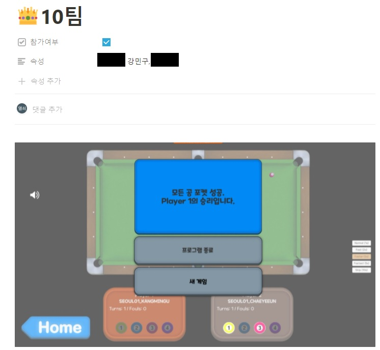
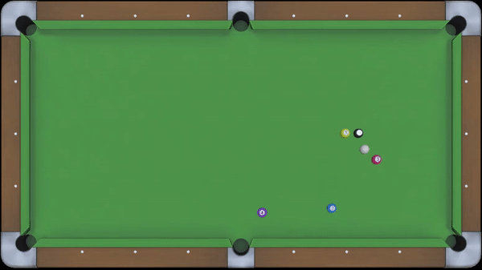
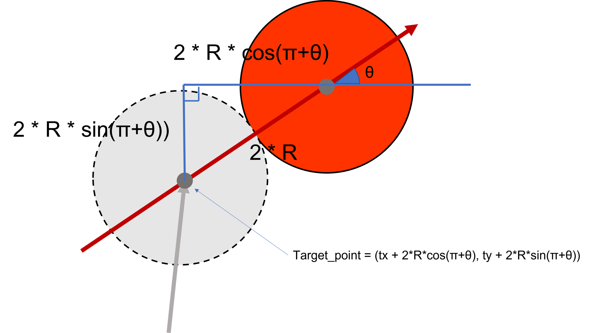
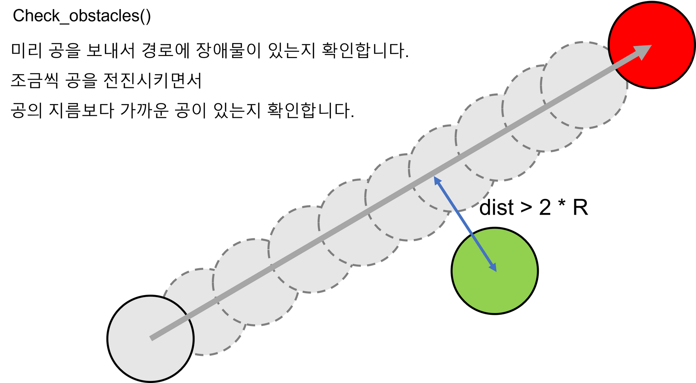

# 스핀 없는 당구 게임

## 성과 

### 3인 1조로 11팀 중 1등👑!!!




### 원턴킬



## 개요

### 룰 설명

흰공을 쳐서 

1팀이 노란, 빨강, 검정을 

2팀이 보라, 파랑, 검정을

먼저 홀인하면 승리하는 당구 게임


공을 넣으면 턴을 넘기지 않고 다시 치지만,

마지막이 아닌데 검은 공을 넣으면 즉시 패배


## 코드

전략 : 공을 넣기 위해 이동해야하는 곳을 역으로 계산하여 그곳에 도달하는 방법을 모색한다.

```python
import socket
import time
from math import radians, degrees, atan2, dist, cos, sin
# math 라이브러리를 적극적으로 이용했습니다.
# radians(x) : 각도 x를 radian으로 반환합니다.
# degrees(x) : radian x를 각도로 반환합니다.
# atan2(y, x) : atan(y/x)와 같은 일을 하지만, division 0 에러가 발생하지 않습니다.
# dist(pointA, pointB) : 두 점간의 거리를 구해줍니다.
# cos(x) : radian x의 코사인 값을 구합니다.
# sin(x) : radian x의 사인 값을 구합니다.

# 게임 환경에 대한 상수입니다.
TABLE_WIDTH = 254
TABLE_HEIGHT = 127
NUMBER_OF_BALLS = 6
HOLES = [[0, 0], [127, 0], [254, 0], [0, 127], [127, 127], [254, 127]]

def play(conn, gameData):
    # 상수
    # BALL_SIZE = 5.73
		# 주어진 공의 크기는 5.73이지만, 
    # 당구공의 이동 방식이 시간 프레임마다 이동이라고 생각해서,
    # 정확도를 올리기 위하여공의 크기 관련 연산을 빽빽하게 하기 위하여 숫자를 조금 깎았습니다.
    BALL_SIZE = 5.5
    BALL_RADIUS = BALL_SIZE/2 

    angle = 0.0
    power = 0.0

		# 주어진 두 점간의 각도를 구합니다. 각도는 저희가 익숙한 x축을 기준으로 계산됩니다.
		# 기본적으로 math 에서 제공하는 arctan 함수를 이용하였고, 두 지점의 x 축 좌표가 동일할 경우, 
		# ZeroDivisionError 가 발생할 수 있기 때문에 atan2 함수를 사용하였습니다.
    # 요구하는 범위가 0~ 360인 경우가 많아서 360으로 나눈 나머지를 사용하였습니다.
    def get_angle(start, end):        
        return degrees(atan2((end[1]-start[1]), (end[0]-start[0]))) % 360

    
		# 주어진 목적구와 홀에 대해서, 목적구의 어디를 맞춰야 홀에 목적구를 넣을 수 있을지 해당하는 지점을 계산하는 함수 입니다.
    # 흰 공이 어디서 오든 충돌 지점의 법선 방향으로 목적구가 이동하기 때문에 
    # 목적구와 홀을 이은 직선의 각도를 고려하여 흰공의 타겟 지점을 구할 수 있습니다.
    def get_target_point(target, hole):
        angle_hole = get_angle(target, hole)
        x = target[0] + BALL_SIZE * cos(radians(180 + angle_hole))
        y = target[1] + BALL_SIZE * sin(radians(180 + angle_hole))
        try:
            print('tp', HOLES.index(hole), angle_hole, x, y)
        except:
            print('tp', angle_hole, x, y)
        return x, y

    def get_cos(white, tp, hole):
        return cos(radians(get_angle(white, tp)) - radians(get_angle(tp, hole)))

		# 주어진 두 점 start와 end 사이에 장애물이 있는지 체크하는 함수입니다.
		def check_obstacle(start, end):
        sx = start[0]
        sy = start[1]
        ex = end[0]
        ey = end[1]
        theta = atan2((ey-sy), (ex-sx))
        x = sx
        y = sy
        # 조사대상 제외 = target 공과 흰 공
        check_data = gameData.balls[1:]
        if [sx, sy] in gameData.balls[1:]:
            check_data.remove([sx, sy])
            # print('YES')
        print('chk_ball Origin : ', check_data)
        while dist((x, y), (ex, ey)) > BALL_RADIUS and check_data:
            # 충돌 판정
            flag = False
            for ball in check_data:
                if dist((x, y), ball) <= BALL_SIZE:
                    # 충돌 발생
                    flag = True
                    print('충돌종류 : ', (sx, sy), (ex, ey))
                    print('충돌지점 : ', (x, y))
                    break
            if flag:
                # 충돌 있습니다.
                return True
            # 탐지기 전진
            x += (BALL_RADIUS/10) * cos(theta)
            y += (BALL_RADIUS/10) * sin(theta) 
        else:
            # 충돌 없습니다.
            return False

    # 흰 공 좌표 리스트
    white = gameData.balls[0]

    # 선공(1) 후공(2)        
    if gameData.order == 1: 
        target_lists = [1, 3]
    else:
        target_lists = [2, 4]
    target_balls = list()
    for target in target_lists:
        if gameData.balls[target][0] != -1: # y축 생략
            target_balls.append(target)
    # 목적구 다 들어갔는데 게임이 안 끝남 = 남은 타겟은 8번
    if not target_balls:
        target_balls = [5]
  
    # 공 기준으로 위치 작성
		# 저희는 남은 공이나 공 위치 자체에 우선순위를 두지 않고, 
		# 공을 쳤을때의 각도를 우선 순위에 두었습니다.
    target_points = list()
    for target in target_balls:
        target_points.append((gameData.balls[target][0], gameData.balls[target][1]))

    # 여기서부터 시작
    answer = [0, 0]
    max_cos = -1
    for hole in HOLES:
        for target_point in target_points:
            tx, ty = get_target_point(target_point, hole)
            if check_obstacle(white, (tx, ty)) or check_obstacle(target_point, hole):
                continue

            # 진입각 발사각 비교
            temp_cos = get_cos(white, (tx, ty), hole)
            print(temp_cos)
            if temp_cos > max_cos:
                max_cos = temp_cos
                answer = [tx, ty]
                power = dist(white, answer) + dist(answer, hole)

    # 노 쿠션 클린 힛 가능?
    if answer == [0, 0]:
        answer = [gameData.balls[target_balls[0]][0], gameData.balls[target_balls[0]][1]]
        power = 100
    angle = (90 - get_angle(white, answer)) % 360
    print('final', answer, power)
		# 일반적인 상황에 거리 0
    power = min(100, power * 0.35)
    conn.send(angle, power)

def main():
    conn = Conn()
    gameData = GameData()
    while True:
        gameData.read(conn)
        if gameData.balls[0][0] == SIGNAL_ORDER:
            gameData.arrange()
            continue
        elif gameData.balls[0][0] == SIGNAL_CLOSE:
            break
        gameData.show()
        play(conn, gameData)
    conn.close()

if __name__ == '__main__':
    main()
```


## 그림 해설


get_target_point(x, y)





