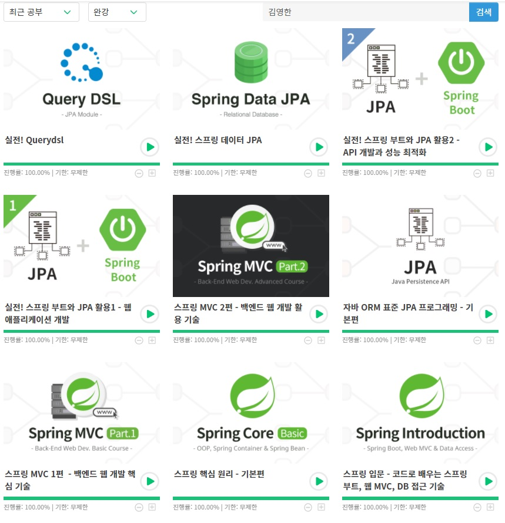

# Spring Framework

## 00. 개요

- 학습 방법 : 인프런 -> 우아한형제들 개발팀장 김영한의 스프링 완전 정복
- 학습 기간 :  210821 ~ 211109 (3개월, history 참조)

- 강의 내용

> 스프링 입문 - 코드로 배우는 스프링 부트, 웹 MVC, DB 접근 기술 (5h 21m)
>
> 스프링 핵심 원리 - 기본편 (12h 7m)
>
> 스프링 MVC 1편 - 백엔드 웹 개발 핵심 기술 (15h 22m)
>
> 자바 ORM 표준 JPA 프로그래밍 - 기본편 (16h 1m)
>
> 스프링 MVC 2편 - 백엔드 웹 개발 활용 기술 (21h 5m)
>
> 실전! 스프링 부트와 JPA 활용1 - 웹 애플리케이션 개발 (7h 44m)
>
> 실전! 스프링 부트와 JPA 활용2 - API 개발과 성능 최적화 (6h 38m)
>
> 실전! 스프링 데이터 JPA (7h 17m)
>
> 실전! Querydsl (6h 24m)
>
> 스프링 DB 1편 (10h 4m)
>
> 스프링 DB 2편 (13h 59m)
>
> 스프링 핵심 원리 - 고급편 (16h 41m)

- 강의 상황 : 22.09 기준 김영한 시리즈 완강 (138h 43m)

## 01. 스프링 입문 - 코드로 배우는 스프링 부트, 웹 MVC, DB 접근 기술

관련 프로젝트 : 00.hello-spring

## 02. 스프링 핵심 원리 - 기본편

관련 프로젝트 : 01.basic-example1

## 03. 스프링 MVC 1편 - 백엔드 웹 개발 핵심 기술

관련 프로젝트 : 02.MVC1-JSP, 03.MVC1-springMVC, 04.MVC1-webPageMaking

## 04. 자바 ORM 표준 JPA 프로그래밍 - 기본편

관련 프로젝트 : 05.JPA0-JPABasic, 06.JPA0-shopOrder, 07.JPA0-JPQL

## 05. 스프링 MVC 2편 - 백엔드 웹 개발 활용 기술

관련 프로젝트 :  
08.MVC2-thymeleafBasic  
09.MVC2-thymeleafForm  
10.MVC2-message  

11.MVC2-validation  
12.MVC2-login  
13.MVC2-exception  
14.MVC2-typeconverter  
15.MVC2-upload  

## 06. 실전! 스프링 부트와 JPA 활용1 - 웹 애플리케이션 개발

관련 프로젝트 : 16.JPA1-jpashop

## 07. 실전! 스프링 부트와 JPA 활용2 - API 개발과 성능 최적화

관련 프로젝트 : 16.JPA1-jpashop (06. 실전! 스프링 부트와 JPA 활용1에서 이어짐)

## 08. 실전! 스프링 데이터 JPA

관련 프로젝트 : 17.JPA2-jpadata

## 09. 실전! Querydsl

관련 프로젝트 : 18.Querydsl-querydsl

## 10. 스프링 DB 1편

관련 프로젝트 : 25.DB1-jdbc

## 11. 스프링 DB 2편

관련 프로젝트 : 26.DB2-각종 DB

## 12. 스프링 핵심 원리 - 고급편

관련 프로젝트 :  
30.Advanced-로그 추적기  
31.Advanced-proxy 패턴  
32.Advanced-스프링AOP  
33.Advanced+DB2-스프링 트랜잭션  

## 기타 1. 프로토콜 시리즈

관련 프로젝트 :  
19.Extra-websocket  
20.Extra-webSTOMP  
23.Extra-MakingProtocol / 직접 만들어보자  

## 기타 2. 스프링 클라우드

관련 프로젝트 :  
21.Cloud-Eureka  
22.Cloud-Gateway  

## 기타 3. 스프링 과거편

관련 프로젝트 :  
24.Extra-MakingCookie  
27.Servlet-기초  

## 99. 감상

"실무에서 스프링 부트와 JPA를 제대로 알고 사용하는 것은 매우 중요합니다."

라는 언급에 걸맞게 라이브 코딩 방식으로 진행하였기 때문에, 단순한 강의 시간 보다 더 많은 시간이 필요하였지만, 직접 써보고

요청 메시지를 HttpServlet을 사용한 v1 부터 @ResponseBody를 사용한 v6까지 추상화된 과정등을 하나하나 구현해본다던가

JDBC Template에서 JPQL, JPA Criteria을 거쳐 Querydsl까지 나아가는 등,

발전 과정을 직접 체험해보는것을 통해 각각의 문장과 그 속에 숨겨진 내용에 대한 더 깊은 이해하고 제대로 된 스프링 사용법을 익힐 수 있었다.

수업 내용과 관련된 강조사항 및 유의사항을 주석으로 정리하고, 전체적인 내용을 약 80페이지에 걸친 노트를 정리하면서 마무리 할 수 있었다!

마지막으로, 현업에서 종사하시는 분이기에 할 수 있는 페치 조인, 지연 로딩, 카운트 쿼리 분리 등 최적화 이슈 등을 중요하게 다루시는게 매우 인상 깊었다.
