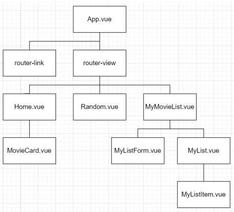
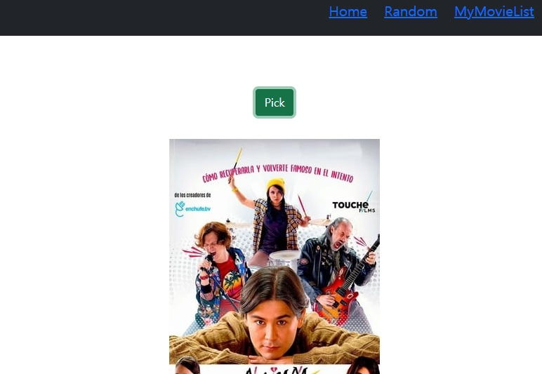
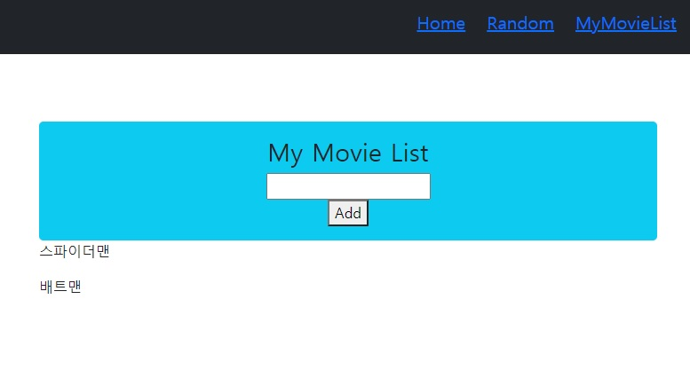

# Vue를 활용한 SPA 구성

## 1. 목표
- 영화 정보를 제공하는 SPA 제작
- AJAX통신과 JSON 구조에 대한 이해
- Single File Component 구조에 대한 이해
- vue-cli, vuex, vue-router등 플러그인 활용

## 2. 요구사항

### A. 컴포넌트 구조

### B. router
i. router view  
Component : Description  
Home : 전체 영화 목록 페이지  
Random : 랜덤 영화 추천 페이지  
MyMovieList : 개인 영화 목록 페이지  

### C. Views & Components

i. UI 구성은 팀별로 자유롭게 진행합니다.
ii. vuex를 사용하였습니다.
iii. Home.vue

1. AJAX 통신을 이용하여 다수의 영화 데이터를 수집합니다.
2. 수집한 영화 데이터의 포스터, 제목, 줄거리를 출력합니다.

iv. Random.vue
1. Pick 버튼을 클릭하면, 수집한 영화 데이터 중 무작위로 하나를 선택하여 출력합니다.

v. MyMovieList.vue
1. 보고싶은 영화 제목을 저장할 수 있는 컴포넌트를 구현합니다. 총 두가지 컴포넌트로 구성되어 있습니다.
2. MyListForm.vue 컴포넌트는 데이터를 입력하는 기능을 가진 컴포넌트입니다.
input 태그에 영화 제목을 입력 후, enter키 혹은 add 버튼을 클릭했을 때 입력한 데이터를 저장합니다.
3. MyList.vue 컴포넌트는 저장된 데이터를 출력하는 기능을 가진 컴포넌트 입니다. 사용자가 입력한 데이터를 출력합니다.

vi. 추가적인 Styling
1. Bootstrap을 활용하여 자유롭게 스타일링 합니다.

## 3. 유의사항
- Bootstrap을 사용하여 기본적인 스타일링을 진행하였습니다.
- 영화 리스트는 반응형 구조로 만들어서 화면이 크면 2개, 작으면 1개만 표시하게 하였습니다.
- NavBar을 별도의 Component로 구별하여, 모듈화하였습니다.
- Store을 가능한 많이 사용하려고 노력했습니다.

## 4. 느낀점
강민구 : 수업도 열심히 따라가고, 라이브코딩도 꽤 실감이 났었는데, 막상 실전으로 작업하려고 하니 많이 낯설었다. Vuex의 store 취급에 조금 더 익숙해져야겠다는 생각이 들었다.  
임건호 : 지난 1주동안 배운 내용들을 복습하고 따라했지만 여전히 막막한 점들이 많았고 더 많은 복습과 다양한 연습을 통해서 자유자제로 사용할 수 있도록 노력해야겠다. + 최종프로젝트를 위한 bootstrap연습 추가  