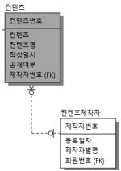
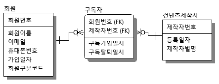
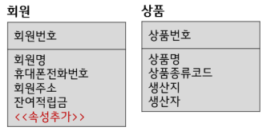
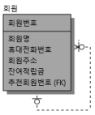
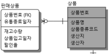
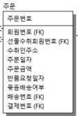
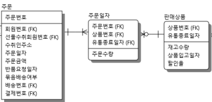
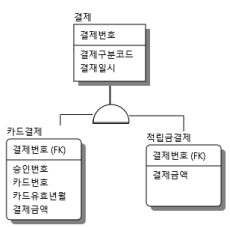
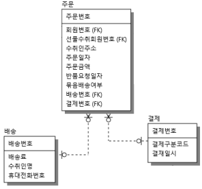
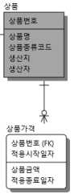

# ERD

시나리오에 맞는 논리 ERD를 작성해보자

## 시나리오 1

- 주어진 기초 테이블  
  
- 공정은 공정코드로 식별한다. 공정은 공정명, 시험유무, 공정내용을 관리한다.
  - 별개 테이블을 만들어서 관리  
  
- BOM은 완제품 또는 반제품을 만들기 위해 필요한 품목과 필요수량을 나열한 목록
  - Notation 정리
- BOM 정보는 BOM 번호로 식별하여 계층적으로 관리하며, BOM명과 적용규격을 포함한다.
  - BOM 번호를 식별자로 가지는 테이블 생성  
  - 식별자에 대해 상위BOM 번호를 재귀하여 계층적으로 관리  
  
- BOM 정보 상세 내용도 관리해야 하는데 반드시 하나 이상의 품목과 필요수량을 관리해야 한다.
  - 품목은 주어진 '테이블'이다. 반드시이니 식별(실선)로 연결될 필요가 있다.  
  
- BOM 공정정보는 BOM 공정정보로 식별되어 BOM 공정명과 BOM 공정설명을 포함한다.
  - 테이블 생성  
  
- 하나의 BOM 공정정보는 반드시 하나 이상의 공정을 포함하여야한다.
  - 공정은 '테이블'이다. 반드시이니 식별(실선)으로 연결될 필요가 있다.
- 공정 순서대로 BOM 공정상세 흐름이 관리되어야 한다. 하나의 공정상세 흐름에는 중복되는 공정이 없어야한다.
  - 공정순번을 추가한 중간테이블 BOM공정상세를 추가  
  
- 하나의 BOM 공정정보는 여러 BOM 정보에서 사용될 수 있다.
  - 명확한 1대다연결(비식별/점선)  
  
- 제품 주문이 발생하면(페이크) 제품별 생산수량을 관리하는 일별생산지시서에 기초(식별)하여 제품을 생산한다.
  - 익숙한 주문이라는 테이블을 만들 필요가 없다. 조심  
  
- 모든 품목은 제품생산투입시 선입선출을 위해 창고번호와 입고일자별로 재고수량을 관리하여야 한다.
  - 창고번호와 입고일자가 식별자가 되는 이력테이블 작성  
  
- 품목은 기본품목과, 반제품품목으로 구분되며 기본품목에는 안전재고수량, 반제품품목에는 BOM번호를 관리한다.  
제품과 반제품별로 각각에 해당하는 유일한 고유의 BOM 번호를 사용된다. >> 품목번호로 변환
  - 배타적 수퍼서브 관계, BOM 번호는 BOM정보의 PK이므로 연결하여 관리  
  

## 시나리오 2

- 주어진 테이블
  - 컨텐츠가 삭제되거나 변경될 수 있는지 비식별로 연결  
  
- 회원은 무료회원과 유료회원으로 구분.  
유료회원은 유료회원가입일시, 유료회원등급을 관리  
무료회원은 유료회원탈퇴일시를 관리
  - 배타적 수퍼서브 관계  
  
- 컨텐츠 제작자는 유료회원만 등록 가능하고 제작자번호로 식별하며 등록일자, 제작자 별명을 관리
  - 새로운 테이블 생성
- 한 명의 유료회원은 여러 컨텐츠제작자로 활동이 가능
  - 비식별로 1:N  
  
- 컨텐츠는 컨텐츠제작자가 주로 만들어 등록하나 업체가 직접 등록한 컨텐츠도 있음.
  - 비식별로 1:N  
  
- 회원이 구독한 컨텐츠는 이력 보관을 위해 구독일시와 컨텐츠여부를 포함하여 컨텐츠구독이력으로 관리
  - 다대다인 회원과 컨텐츠간의 중간테이블로 구독이력을 추가  
  
- 컨텐츠보관여부가 "Yes"로 표현되는 경우, 컨텐츠 보관함에 컨텐츠보관번호를 식별하여 컨텐츠보관일시를 포함하여 관리
  - 1대 N인 비식별연결 테이블 추가  
  
- 회원은 컨텐츠제작자에 대해 구독신청할 수 있으며, 구독가입일시, 구독탈퇴일시와 함께 구독자로 관리한다.
  - 다대다인 회원과 컨텐츠제작자간의 중간테이블로 구독자 테이블을 추가. 중간테이블이니 식별
  
- 회원은 컨텐츠에 댓글을 달 수 있으며, 댓글은 댓글일련번호로 식별하고, 작성일시와 댓글내용을 컨텐츠 댓글로 관리
  - 새로운 테이블. 회원이 삭제되어도 댓글은 남아있으니 비식별
  - 또한 회원은 기 작성된 댓글에 댓글을 달 수 있으며 = 상위댓글일련번호로 재귀  
  
- 회원의 검색기록은 검색일시 검색어를 포함하여 관리한다.
  - 식별자 얘기가 없지만 테이블 추가. 식별자는 검색일지. 식별연결  
  

## 시나리오 3

- 주어진 테이블  
  
- 회원 가입 시 기가입한 회원이 추천한 경우, 추천회원 정보를 함께 관리하며 기존 회원은 여러 회원에게 추천받을 수 있음
  - 재귀테이블에 FK로 추천회원번호 추가  
  
- 판매상품은 상품별로 유통기한이 정해져 있어 입고일자와 유통종료일자가 필요하며, 유통종료일자별로 상품수량을 관리.
  - 그 밑에 유통종료일자에 따라 상품을 폐기하거나 할인율이 달라짐 >> 할인율을 DB에서...?
  - 유통종료일자가 여러 역할을 하니 식별자로 사용하고 상품과 1대 N이 되게 테이블을 구축  
  
- 주문은 주문번호로 식별하며 수취인주소, 주문일자, 주문금액, 반품요청일자를 관리  
  
- 주문 시 판매상품목록에서 반드시 하나 이상의 상품과 주문수량을 선택하여 주문내역을 보관하였다가 진행  
  
- 결제는 하나 이상의 주문에 대해 묶어서 처리할 수 있으며 결제번호로 식별되고 결제금액과 결제일시가 관리
  - 이 때 묶음배송여부를 체크하여처리할 수 있다 : 필요없는 내용
- 결제수단은 카드나 적립금으로 처리해야하며 결제수단 조합 가능. 카드 결제는 승인번호 카드번호 카드유효년월이 관리
  - 고난이도) 결제금액을 아래로 보내고 결제구분코드를 결제가 물고 있다.  
  
- 배송은 배송번호로 식별되며 배송료, 수취인명, 휴대전화번호가 관리된다.
  - 배송테이블 생성
  - 여기서 배송과 결제는 주문에 각각 1:N로 묶인다.  
    
- 상품금액은 변동될 수 있으므로 적용시작일자와 적용종료일자가 관리
  - 적용시작일자가 식별자인 테이블을 하나 만들자.  
  

## 기타

- 키워드
  - XX로 식별하며 : 해당 컬럼을 식별자로 가지는 테이블을 만들어라
  - 보관, 관리 : 이하의 정보가 DB안에 있어야 한다.
  - 중간테이블 : 무조건 식별관계
  - 이력테이블 내지 일자관리(시작일자, 종료일자가 있는) 테이블 : 식별관계
  - 배송,주문,결제,댓글 : 비식별이어도 이상할 것 없음
