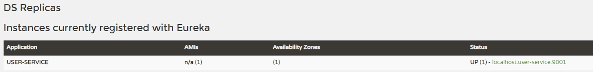

# Spring Cloud Eureka

Service Discovery, Service Registry 서비스

- Server 설정

dependency : Eureka Server

1. `@EnableEurekaServer` main에 추가
2. application.yml 작성

```yaml
server:
  port: 8761

spring:
  application:
    name: discoveryService

# 유레카 본인을 유레카에 등록하는 행위를 하지 않는다.
eureka:
  client:
    register-with-eureka: false
    fetch-registry: false
```

- Client 설정

dependency : Web, Lombok, Eureka Discovery Client, Spring Boot Devtools

1. `@EnableDiscoveryClient` main에 추가
2. application.yml 작성

```yaml
server:
  port: 9001

spring:
  application:
    name: user-service

eureka:
  client:
    register-with-eureka: true
    fetch-registry: true
    service-url:
#      defaultZone: http://localhost:8761/eureka
      defaultZone: http://127.0.0.1:8761/eureka  # 서버 위치
```

- 구동 : 서버와 Client를 둘 다 run 해보자

  1. [http://localhost:8761/](http://localhost:8761/) 에 들어가면 해당 내용을 볼 수 있다.
  (Status : UP - 현재 작동중, 주소-서비스이름-포트로 구성되어있다.)

  
  2. 우측 상단에서 edit configuration으로 항목을 증가시키거나 환경변수를 설정할 수 있다. (질문 필요)

  ```yaml
  -Dserver.port=9002 이런식으로
  ```

   작동시, Availability Zone의 숫자가 2로 증가한것을 확인할 수 있다.

  이제 해당 서비스가 요청이 오면 분산되어 배치할 것이다.
  3. 빌드 후 직접 선언시 port 부여하는 방법

  ```yaml
  mvn spring-boot:run -Dspring-boot.run.jvmArguments='-Dserver.port=9003'
  로 테스트 후 (maven)

  java -jar -Dserver.port=9004 ./target/user-service-0.0.1-SNAPSHOT.jar
  ```

  로 빌드된 파일도 해보기
  4. 랜덤 포트

  ```yaml
  server:
    port: 0

  # 부여하지 않으면 서버가 여럿 돌아도 0으로 Availability Zone 내용이 늘어나지 않은 것 확인할 수 있는데. 
  eureka:
    instance:
      instance-id: ${spring.cloud.client.hostname}:${spring.application.instance_id:${random.value}} # 랜덤 포트 부여시 정보
  ```

로드밸런싱을 이렇게 쉽게 구현할 수 있는게 spring-cloud의 장점
