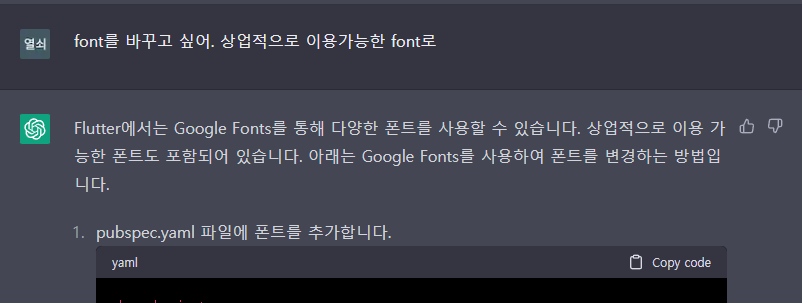
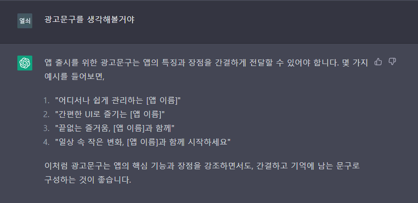
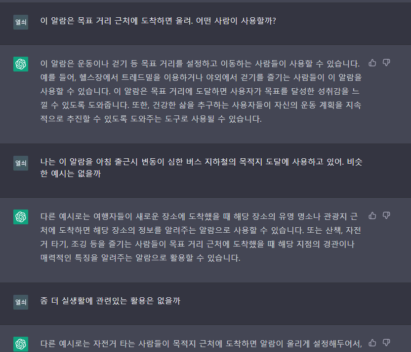
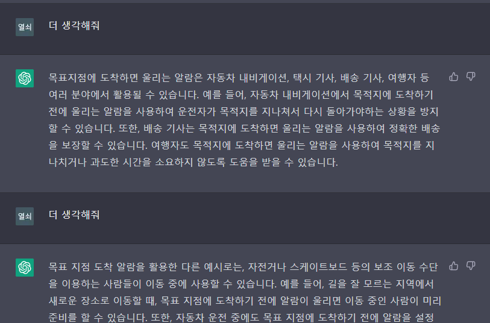
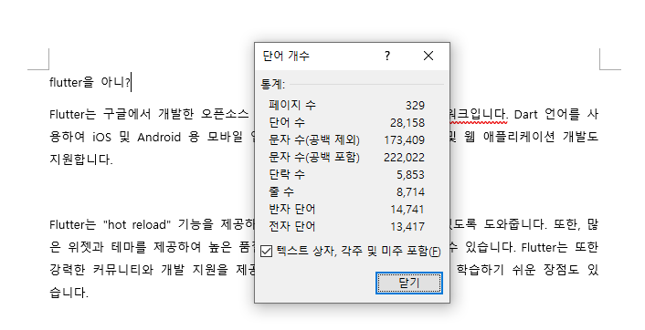
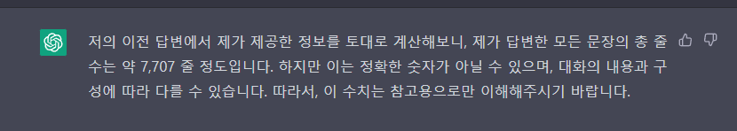
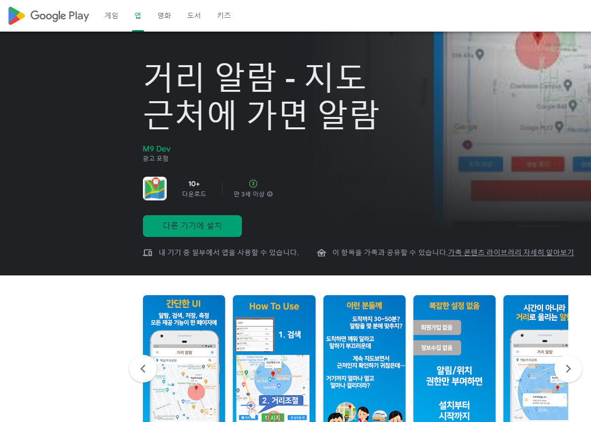

# ChatGPT로 앱 만들기

- 개요 : 하고 싶은 일과 목적이 뚜렷하면 AI 기술적인 도움을 받아 목표를 성취할 수 있을까?
- 한 줄 결론 : 네

## 목적

- 배경
  - 금융팀은 기본 사이트 출근입니다. 저는 현재 출퇴근에 버스를 이용하는데 버스라는 것이 같은 길을 가도 이동시간이 유동적이기 때문에 어떨때는 30분만에 도착하고 어떨때는 50분 걸릴때도 있고, 심할때는 1시간이 넘게 걸릴 때도 있어을 정도로 그 변동폭이 큽니다.
  - 그럼 나는 버스를 타고 이동할 때 알람을 30분에 맞춰야 할까? 40분에 맞춰야할까?
- 해결안 : 몇 분 후가 아니라 도착할 때 쯔음에 울리는 알람을 만들면 되지 않을까?
  - 그런데 놀랍게도 [구글 플레이 스토어]에 그런 앱이 없었다.
    - 당신이 생각해본 사업아이템은 이미 다 있다라 불리는 이 세상에 없다니 돈이 안되긴 하나보다.
- 목표
  - 그럼 만들면 되지 않을까
- 주체자 스펙 : 강민구
  - 앱 개발 경험 0일
  - 구글 개발자 계정이라는게 존재하는지도 모름

## 적용 사례

1. chatGPT 과연 쓸만할까?
     - 나는 앱 개발 경험은 없지만, flutter라는 입문이 쉽고 초보자도 가볍게 다룰 수 있다는 프레임워크가 존재한다는 사실을 알았다. 애초에 이걸 chatGPT가 모르면 얘기가 되지 않았기 때문에 우선 chatGPT를 시험에 들게 하였다.
     - Q. 대망의 첫 질문
     
       - A. 답변 퀄리티 봐라...?
     - Q. 하고 싶은 일이 가능하기 전에 백그라운드를 물어봤을 뿐인데  
     
       - A. 코드를 뱉기 시작한다. 뭐라는거야...  
       당시에는 패키지가 뭔지도 모르고, flutter 프레임워크가 dart라는 언어를 쓰는줄도 몰랐다.
2. chatGPT에 질문을 하기 위해서는 우선 내가 알아야한다.
   - AI에 질문을 하는 직업이 생길거라는 글을 읽은적이 있다. 내 상황이 이랬다.  
   chatGPT는 내 생각 이상으로 지나치게 유용했고, 오히려 바보는 나인 상황.
   - 그래서 질문하기 위해 인강을 등록했다.
     - 어 이게 무슨 chatGPT야. 하시는 분들. 일단 알아야 말은 통하고 물어봅니다. 진짜로.
     - 인강을 통해서 개발환경이 세팅될 것이고(프로그램 설치도 안됨), 패키지... 가 뭐에요? 상태를 해결할 수 있을 것이라고 보았기 때문이다.
       - 결과부터 말하면 다 해결되었다. 거기다가 참고할 스켈레톤 코드라는 예상치 못한 변수도 생겼다.
   - 하루 잡아서 인강만 들었다.
     
    <쌩'초보자' 인강으로>  
   - 물론 하루만에 다 들을 수 있을리도 없고, 지금도 이 상태이다. (광고아님)  
     
   <구몬선생님도 없고, 필요한 부분만 듣고 완강 안해도 되는점이 직장인 인강의 강점...!>
3. 2일차부터, 시작해볼까!
   - Q. 내가 만들 앱을 설명해 보았다.  
     
   A. 뭔가 평가가 시작되었다.
   - Q. 일단 던져보았다.  
   앱개발내내 가장 많이 쓴 단어: 구현해줘, 써줘, 고쳐줘  
     
     
   A. 아 역시 안되나...?  
     
   A. 라더니 무언가 시작되었다.  
   - Q. 내가 인강에서 쓴 스켈레톤 코드에서 location이라는 패키지를 썼기 때문에 징징대보았다.  
     
   A. 상상치도 못한 답변이 돌아왔다. 내 장자방이 여기 있었던것 같다.  
   - 이후 스켈레톤 코드를 입력하며 이걸 기반으로 구현해달라는 말을 했고, 개조가 시작되었다.
     - 다만 스켈레톤 코드에 저작권이 있어 해당 내용과 사진은 생략하겠습니다.
4. 앱 개발: 실제 개발하면서 일어난 일을 다 쓰면 엄청 길고(후술), 중요한 포인트 위주로 몇몇개만 이벤트만 정리해보겠습니다.
   1. DB 설계 : XX를 XX에 저장하고 싶어 하면 코드를 짜줍니다.  
   
   2. DB 수정 : 코드가 바뀌었으니 DB가 바뀌어야겠지? 하면 알아서 바꿔줍니다.  
   
   3. API 분석 : 사용하는 openAPI가 원하는 값을 주지 않는다고 말하면 API를 분석하고 추천해줍니다.  
   
   4. Packge(라이브러리) 추천 : 이제는 Library 알아보지도 않고 추천부터 받을정도로 타락(?)합니다.  
   
   5. 주석 : 엄청 잘 써줍니다. 한글로  
   
   6. 원하는 대답이 나올때까지 질문을 바꿔야합니다.  
     
   <계산할 수는 있지만 내가 안다고 하지는 않았다.png>  
     
   <답은 알지만 뭘 물어보는지는 모르겠다는 아름다운 사태.png>  
     
   <틀린식을 당당히 말하는 AI.png>  
     
   이 대답을 듣는데 21번의 질답이 오갔고, 수치만 수정해서 잘 쓰고 있습니다.  
   7. 칭찬 : 문장은 셀 줄 모르지만 칭찬은 엄청 잘합니다.  
   
5. 트러블 슈팅 : chatGPT 특징 중 하나라고 봐도 될 정도로 트러블 슈팅 엄청 잘 합니다.
   1. 콘솔에 있는 에러문구 그대로 긁어서 입력하면 여태 입력한 코드를 살펴보고 답을 줍니다.  
   
   2. 안되도 여전하다고 말하면 사과하고 더 찾아봅니다.  
   
   3. 기업제휴여야 가능한지 API인지(=애초에 안되는지) 물어보면 답해줍니다.  
   
   4. 코드가 틀렸다고 지적하면, 이 이후 코드 다시 짜줍니다.  
   
6. 상용화 : 프로젝트의 끝은 상용화라고 하던가요. 아 여기까지 왔으면 구글 플레이 스토어 출시도 해봐야지. 도와줘 chatGPT!
   1. 문제 발생 안 할 폰트 알아봐줘  
   
   2. 광고문구 짜줘.
   
   3. 마켓팅 타겟 조사해줘.  
   
   4. 아니야 모자라 더더더
   
7. 마무리
   - 인강 들은 첫 날 포함 그 날부터 구글스토어 출시 제안한 여기까지 **'4일'** 걸렸습니다.
   - 워드로 옮겨보니 첫 질문부터 마지막 질문까지 8714줄의 질답이 오갔네요.  
   
   - 그 중의 본인의 지분을 주장하는 chatGPT...  
   에러에 관해 2줄밖에 대답 안했다는 어리버리함과 겸손함이 없어진 훌륭한 자기 PR이었습니다...  
     
   - 결국 무사히 출시했습니다!  
   구글 플레이 스토어에 '거리 알람' 검색하시면 나옵니다.(광고 아님. 아무튼 아님.)  
   

## 프로젝트에 적용해 본다면

- 저 개인은 저 앱 개발 이후, 출근 퇴근할때 알람 켜놓고 푹 취침하면서 출퇴근할 수 있게 되어 삶의 질이 올라갔습니다.  
(광고 아님. 아무튼 아님.)  
- 프로젝트 적으로는 금융에는 망분리라는게 존재하니 바로 적용할 수는 없습니다.  
다만, 제가 사용한 현 chatGPT는 특수한 서드파티를 설치하지 않는 한 웹과 연결되어 있지 않는데, 이런 버전이어도 이 정도 일이 가능하다?  
chatGPT 아마도 KAFKA나 REDIS처럼 외부 기업이 솔루션의 형태로 판매 제공할 것이라고 생각합니다. (이걸 내가 해야 되는데)

## 느낀점

- chatGPT의 생산성은 곱하기로 주제에 따라 다르겠지만 제 기준으로 1.5~5배 정도 된다고 느꼈습니다.
- 모각코를 자주했었는데, 질문과 답변을 자연어로 오가게 되면 누군가와 같이 작업하는 느낌이 들어 모각코하는것 마냥 코딩이 멈추지 않게 됩니다.
- 답이 길어지면 멈춥니다. 그리고 답이 코딩일 경우 그럴 경우가 많습니다. 팁인데 그냥 'please continue'라고 써주세요.
  - 질문을 다시 하거나, 설명을 자세히 하거나, 계속해줘라고 한국어로 말하거나 감정에 호소하시면 안됩니다.
- 해당함수가 deprecated 되었다고 말하면 우회를 잘 찾아옵니다.
- chatGPT는 한글을 그렇게 잘 인식하지 못한다고 알려져있는데 개발자는 오히려 영어와 한국어를 섞어 쓰게되면 영어를 함수나 변수로 인식해준다는 부가적인 효과를 받는다고 느꼈습니다.

P.S.

1. 다음 앱으로 만들 재밌어보이는 아이디어 받습니다.
2. 공모전이나 인생에 활력을 주는 재밌어보이는 이벤트 환영  
3. 거리 알람은 안드로이드에만 있습니다.  
제가 맥북이 없어서 컨버팅을 못해요 ㅎㅎ... 애초에 필요한지도 프로젝트 중에 알았습니다.  
출시도 안해놓고 거짓말 하는거 아니냐고 하실까봐 ㅠㅠ...  
