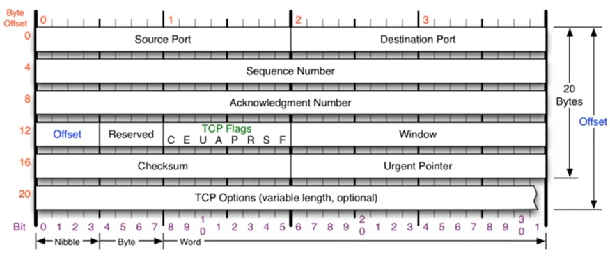

# 4계층 TCP

## 개요

- 연결지향형 프로토콜, 안정적으로, 순서대로, 에러 없이 교환하는 것을 도움
- UDP보다 안전하지만 느리다. (구분될정도로 압도적으로 느리지는 않다.)
- 세그먼트 : TCP를 이용하여 전송되는 데이터 단위

## 세그먼트 헤더 구조

- 기본 20바이트 Option 붙을때마다 4바이트씩 최대 60바이트
- Source Port, Destination Port : 발신자, 수신자
- Sequence Number, Acknoledgement Number : TCP 통신에 활용, 자세한 내용은 하단.
- Offset : 조립시 사용되는 시작 위치
- Window : 데이터 잘 받았을때, 남아있는 사용공간(TCP 버퍼 공간, 그만큼 보내도 된다는 내용)을 말해줌
- Reserved : 예약된 필드 사용하지 않음
- TCP Flag : TCP의 주된 기능을 나눔

## TCP Flag

보내도 되는지 확인, 내용이 긴급한지 등의 값

- Urg : 긴급 데이터, Urgent Pointer가 가르키는 값이 긴급 값.
- Ack : 확인 응답, 물어본 것에 대한 응답, 승인에 사용.
- Push : 데이터 밀어내기, TCP 버퍼가 쌓이지 않아도 데이터를 밀어 넣겠다는 내용
- Reset : 초기화 비트, 비정상적 연결 해제
- Sync : 동기화 플래그, 연결 시작시 무조건 사용한 만큼 제일 중요. 연결 설정에 사용
- Finish : 연결 해제에 사용

## TCP를 이용한 통신과정

### 3-Way handshake : 연결과 송수신

- 연결 수립 과정(연결 수립을 위한 통신)
  TCP를 이용한 데이터 통신을 할 때 프로세스와 프로세스를 연결하기 위해 가장 먼저 수행되는 과정

1.  클라이언트가 서버에게 요청 패킷을 보냄 (SYNC)
2. 서버가 클라이언트의 요청을 받아들이는 패킷을 보냄 (SYNC + ACK)
3. 클라이언트가 최종적으로 이를 수락하는 패킷을 보냄 (ACK)

- 데이터 송수신 과정
  - 보낸 쪽에서 또 보낼 때는 ACK번호, SEQ 번호 유지
  - 받는 쪽에서의 SEQ 번호는 받은 ACK 번호
  - 받는 쪽에서의 ACK 번호는 받은 SEQ 번호 + 데이터 크기

### 4-Way handshake : 연결 종료

- 연결 종료 과정
  1. 클라이언트에서 서버로 FIN+ACK
  2. 서버에서 응용에 해당 요청 전달하며, 
     클라이언트로 ACK 보냄(1 요청에 대한 응답) + 클라이언트로 FIN+ACK 보냄 (서버로부터의 요청)
  3.  클라이언트에서 서버로 ACK 보냄

## TCP 흐름제어

- 한 번 할 때마다 하지 않고, 여러 패킷을 한번에 송수신한 후 수신 확인 신호를 전송하는것이 효율적

- 윈도우 크기 : 수신 버퍼의 크기, 한번에 전송하는 패킷의 수
- 슬라이딩 윈도우 : 받은데까지를 말해줘서, 송신 윈도우를 이동하게 만들고, 거기서 부터 보내게 만드는 방식

## TCP 상태전이도

TCP 연결 상태의 변화 (주요 2가지만 체크)

- Listen : 클라이언트의 요청을 응답할 수 있게, 항상 듣고 있는 상태
- Established : 서로 연결이 수립이 된 상태

