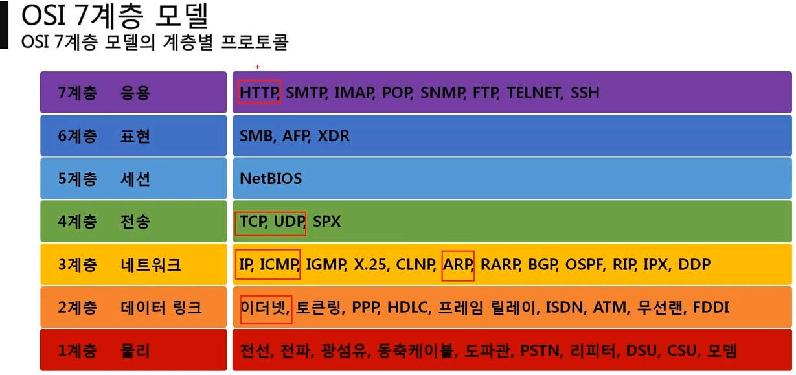

# 네트워크와 모델

## 네트워크 계층 모델

- TCP/ IP 모델 : 최초의 모델, 4계층, 네트워크인터페이스 / 네트워크 / 전송 / 운용, 프로토콜 기반, 데이터 전송 특화
- OSI 7 계층 : ISO에서 국제 표준으로 지정한 모델, 7계층, 역할 기반, 통신 전반

> 네모친 부분은 프로토콜까지 파악해야한다.

## 패킷

네트워크를 통해 전달 되는 데이터 통칭, 네트워크에서 전달하는 데이터의 형식화된 블록(여러 번 포장된 포장상자)

제어정보(헤더, 필요하면 푸터) + 사용자 데이터(페이로드)로 구성

- 캡슐화 : 데이터부터 시작하여 여러 프로토콜을 조합하여 패킷을 만드는 과정 (<-> 디캡슐화)
  - 세그먼트 : TCP + 데이터, 4계층
  - 패킷(이름만 같음) : IPv4 + TCP + 데이터, 3계층
  - 프레임: Ethernet + IPv4 + TCP + 데이터, 2계층

