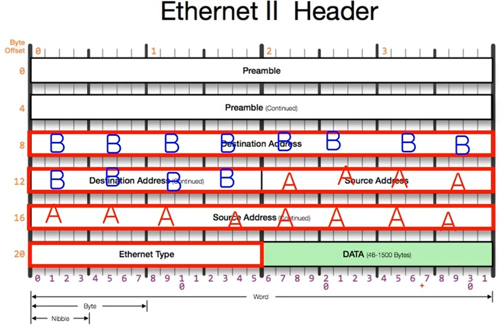

# 2계층

## 개요

- 같은 네트워크 상에 존재하는 여러 장비간 데이터 전달

- 계층 내 네트워크 LAN 통신, 다른 네트워크와 통신시 3계층 필요

## MAC 주소

- 2계층(LAN 통신)에서 사용하는 주소, 물리적인 주소
- 12개의 16진수로 구성 6C-29-95-04-EB-A1 ; 제조회사 식별 ID + 제조사 부여 고유번호
- 16진수 하나당 4비트

## 2계층 프로토콜

Ethernet 프로토콜

- 목적지, Destination Address : 6바이트 => 16진수 12글자
- 출발지, Source Address : 6바이트 => 16진수 12글자
- Ethernet Type : 2바이트 => 페이로드 상위 프로토콜 메타 정보(3계층 프로토콜 : IPv4, ARP, etc...)
  - 08 00 -> IPv4 , 08 06 -> ARP

