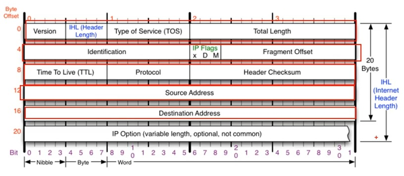

# 3계층 IPv4

## 개요

- 네트워크 상에서 데이터를 교환하기 위한 프로토콜
- 데이터가 정확하게 전달될 것을 보장하지 않는다 
- 중복된 패킷을 전달하거나 순서를 잘못 전달할 가능성도 있다.
- 정확하고 순차적인 전달은 그보다 상위 프로토콜(4계층)인 TCP에서 보장한다.

## 구성

- Source Address : 4바이트, 출발지
- Destination Address : 4바이트, 도착지
- Version : IPv4면 4, IPv6이면 6
- IHL : 가변적 길이를 갖는 옵션까지 포함한 총 프로토콜 길이
- Total Length : 총 길이
- Identification : 단변화 된 패킷들을 재조립할때 사용, 식별자가 같은 패킷끼리만 합체
- IP Flag : D(on't) ; 1이면 단편화 되지 않음 / M(ore) : 0이면 마지막 단편
- Fragment offset : 재조립시 해당 패킷의 시작 위치. 8바이트 단위, 
  0으로 시작해 시작위치를 8로 나눈값으로 표기

- TTL(Time to Live) : 해당 패킷의 수명이 유효한지 확인하는데 사용, 
  어딘가를 거칠때마다 1씩 감소해서 0이 되면 그 패킷은 버려진다.
- Protocol : 상위 프로토콜이 뭔지 알려줌

- checksum : 오류가 있는지 확인하는데 사용

## 조각화(Fragmentation)

- MTU : 데이터의 최종 전송 단위 (일반적으로 1500바이트로 설정)
- 각 단위에 맞춰서 잘게 쪼개는 행위 
  - 쪼개는 예시
    11980 = 3280 + 3280 + 3280 + 2140 
    3280 = 1280 + 1280 + 720
    2140 = 1280 + 860
  - IPv4 기준 헤더의 값은 20바이트
  - M Flag는 최종의 2140과 860만 0임
- 반대말 : 재조립 Reassembly
