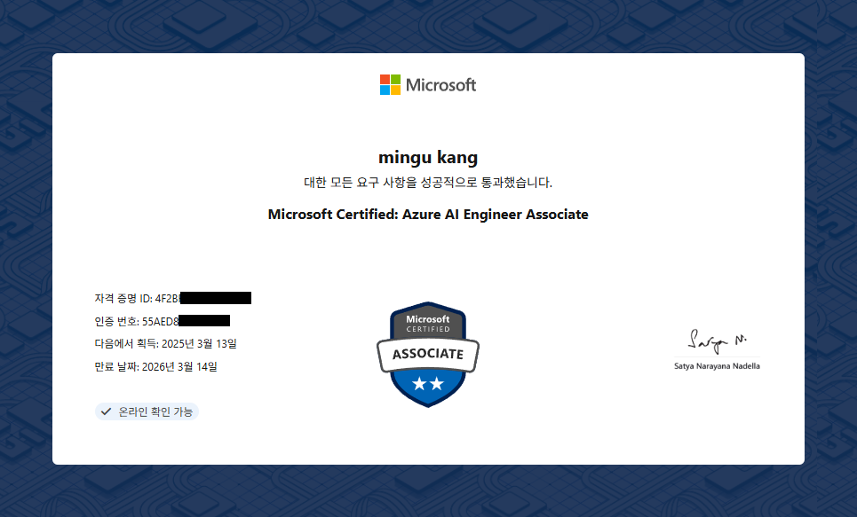
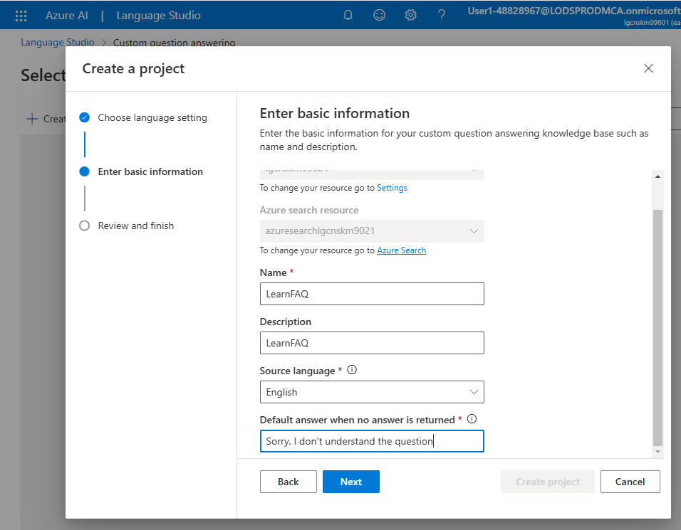
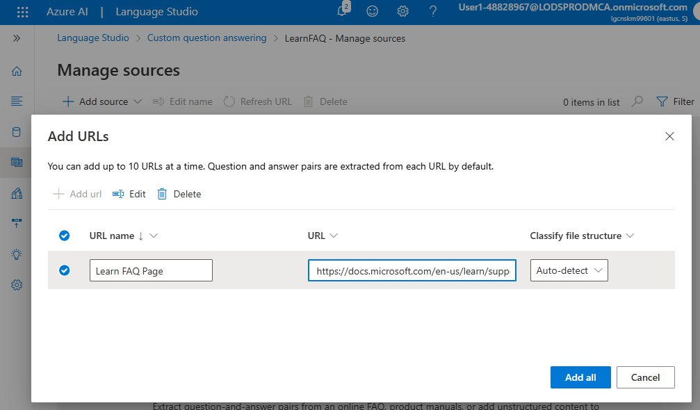

# Microsoft AI-102 실습

- 결론
  - 자격증 취득 성공
    
- 개요
  - AI-102
    - Microsoft Certified: Azure AI Engineer Associate
    - Microsoft의 중급 자격증
  - Microsoft에서 제공된 실습을 진행하고 정리
    - 기간 : 20250224~0228(5days)
  - 실습파일 : DAY별로 정리
    - Q : Clone 원본
    - A : 학습 내용 정리, 코드 수정 및 테스트 결과

## Day 1 : Intro

- 공통 환경 세팅
  - Azure 구독 : 리소스 그룹에 Azure AI 서비스(Azure AI Service) 리소스 만들기
  - 배포(프로비저닝)후 키와 엔드포인트를 .env 파일에 옮기기
- 출처 : [Github : MicrosoftLearning/mslearn-ai-services](https://github.com/MicrosoftLearning/mslearn-ai-services)
- 요약
  - env : 이후 생략
  - 01 : Rest로 호출하는 Azure AI
  - 02 : SDK로 호출하는 Azure AI

## Day 2 : Vision

- 개요 : 이미지 인식 AI
- 출처 : [Github : MicrosoftLearning/mslearn-ai-vision](https://github.com/MicrosoftLearning/mslearn-ai-vision)
- 요약
  - 01 : 이미지 분석(01-analyze-images)
    - caption, dense_captions, tags(추천캡션), Objects(이미지에서 개체 감지 및 찾기)
  - 02 : 이미지 속 글자 인식(05-ocr)
    - 글씨 읽기와 좌표 Bounding
  - 03 : 이미지 분류(02-image-classification)
    - 추가사항
      - 스토리지 계정
        - 설정>구성>Blob 익명 액세스 허용>저장
        - 데이터 스토리지>컨테이너>만들기(이름 fruit)>액세스수준변경>컨테이너
        - fruit 컨테이너로 이동> training-images 및 json 업로드
      - Azure AI : Vision Studio
        - portal AI 와 같은 계정으로 로그인
        - 이미지 분석(Image Analysis) > 이미지로 모델 사용자 지정
        - 나는 리소스 고르고 Datasets 만들고, Import COCO file for labeled data(json) 진행

## Day 3 : NLP

- 개요 : Natural Language Processing, 자연어 처리
- 출처 : [Github : MicrosoftLearning/mslearn-ai-language](https://github.com/MicrosoftLearning/mslearn-ai-language)
- 공통 : Azure Portal > 언어 서비스
- 요약
  - 01 : 텍스트 분석(01-analyze-text) : 특정한 의미를 가지는 단어 또는 구를 식별하여 분류
    - 엔터티(Entity) : 사람, 장소, 조직, 날짜, 숫자, 제품명 등 의미 있는 개체
      - > 예시 : "Elon Musk founded SpaceX in 2002 in California."  
  
        | **텍스트**    | **카테고리 (Entity Category)** |
        |--------------|----------------------------|
        | Elon Musk   | Person (사람)               |
        | SpaceX      | Organization (조직)         |
        | 2002        | DateTime (날짜)             |
        | California  | Location (위치)             |

  - 02 : 질문 답변 솔루션 만들기(qna-app)
    - [Azure AI : Language Studio](https://language.cognitive.azure.com/) 이용
      - 사용자 지정 질문 답변(Custom question answering) (+Azure search 만들고 연결)
      - Create Project 예시  
        
      - 기술자료(knowledge base)용 FAQ자료 가져오기 : 원본관리> Add source
        - [url](https://learn.microsoft.com/en-us/training/support/faq?pivots=general) : 참고하는 Microsoft Learn FAQ의 질문과 대답 쌍
        - chitchat : 제공되는 대화형 잡담 질문과 대답 쌍 세트
        - 이후 상세에서 질문추가, 편집, 대체질문추가, 후속프롬프트
      - 
      - 기술자료 배포(Deploy knowledge base)
        - 예측 URL 가져오기(Get Prediction URL)로 제대로 배포되었는지 체크 가능
  - 03 : 언어 서비스를 사용하여 언어 이해 모델 만들기(03-language)
    - [Azure AI : Language Studio](https://language.cognitive.azure.com/) 이용
      - 대화형 언어 이해(Conversational language understanding)
        - 프로젝트만들기(이름:Clock)>의도(Intents)정의>데이터레이블에발화(Utterence)추가>학습작업>배포
        - 엔터티 추가로 완성도 높이기 : list엔터티로 동의어 설정가능>기존모델덮어쓰기로 학습시작
    - 이후 클라이언트에서 질문시, 해당 서비스 모델 호출하여 예측/결과를 반환 받음
      - 반환 내용 : 상위(가장 가능성이 높은) 의도, 그리고 입력 발화에서 검색된 모든 엔터티
      - 반환된 의도에 맞는 함수를 실행하는 식으로 작업
  - 04 : 음성 인식 및 합성(07-speech)
    - 흔한 STT, TTS를 Azure SDK로 구현
    - Azure Portal의 음성 서비스 사용. 엔드포인트 대신에 key와 REGION이 필요.
    - 음성합성시 SSML로 포맷(목소리 종류, 맺음말 등의 대화포맷) 지정 가능

## DAY 4 : Gen AI

- 개요 : Natural Language Processing, 자연어 처리
- 출처 : [Github : MicrosoftLearning/mslearn-ai-language](https://github.com/MicrosoftLearning/mslearn-ai-language)
- 공통 : Azure Portal > 언어 서비스
- 요약
  - 01 : 앱에 Azure OpenAI 통합
  - 02 : 앱에서 프롬프트 엔지니어링 활용
  - 03 : Azure OpenAI로 자체 데이터 사용

## DAY 5

- 개요 : Natural Language Processing, 자연어 처리
- 출처 : [Github : MicrosoftLearning/mslearn-knowledge-mining](https://github.com/MicrosoftLearning/mslearn-knowledge-mining)
- 공통 : Azure Portal > Azure AI 서비스
  - 리소스>개요>구독>ID,위치확인
    - 예시 : 구독ID 2ca789d9-1760-40b4-91d9-6afc0de68cd4 / 위치 : East US
  - 01 : Azure AI 검색을 위한 사용자 지정 기술 만들기(02-search-skill)
  - 02 : 양식에서 데이터 추출
