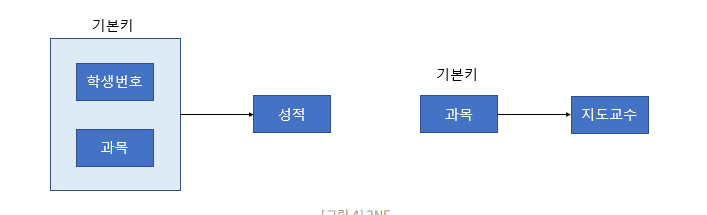
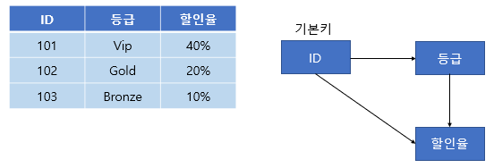
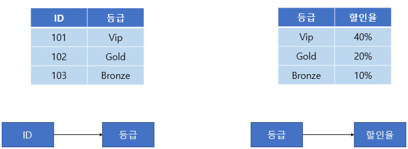
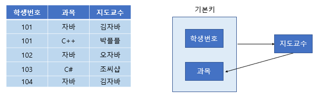
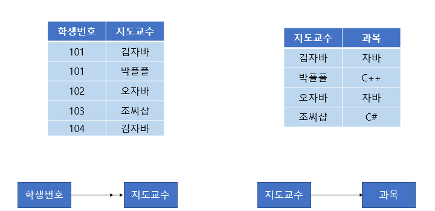

# SE 직군

- 메인 : SE + 웹

## 시험 전 학습 체크사항

- 키워드
- 특별 정리
  - 정규화(NF, Normal Form) : 이상현상 제거
    - 이상현상
      - 삽입 : 원하지 않는 자료가 삽입, key가 없어 불필요한 자료가 있어야 삽입 가능
      - 삭제 : 연쇄 삭제로 인한 정보손실
      - 갱신 : 일부 정보만 갱신되어 모순 발생, 중복 튜플 존재
    - 제 1정규형 : 모든 Domain이 원자값(Atomic)
      - A, B, C가 하나에 있으면 세줄로 변경
    - 제 2정규형 : 부분종속(일부 식별자로 결정 가능)을 없애고 완전종속으로
      - 지도교수를 아는데는 학생번호가 필요없으니 테이블을 분리
      
    - 제 3정규형 : 이행종속(A->B->C가 한 테이블에 있음)이 없어야 함
      - Before  
      
      - After  
      
    - BCNF(Boyce-Code) : 모든 결정자가 후보키가 되게
      - Before : 과목과 지도교수가 1:N 상황에서는 과목으로 지도교수를 알수 없음  
      
      - After  
      
    - 제 4정규형 : 다치 종속 제거
    - 제 5정규형 : 조인 종속 제거
  - 요구사항
    - 기능적
    - 비기능적 : 성능, 안전, 보안, 교육기간...
  - 업무기능분해(MECE) : 업무영역>프로세스>단위프로세스
  - 커버리지
    - 구문 커버리지 : 모든 문장을 실행
    - 조건 커버리지 : 모든 개개 조건문 TF체크
    - 결정 커버리지 : 모든 실선(흐름)을 실행
  - IE 표기법 중
    - 식별자(실선) : 의존적. FK가 식별에 반드시 필요(=부모가 반드시 필요).
      - 부서없는 사원 존재 불가
    - 비식별자(점선) : 독립적. FK가 식별에 필요없고 자체 PK로 식별이 충분(FK가 아래로).
      - 부서없는 사원 존재 가능
  - 기타
    - 응집도는 높으면 좋고 결합도는 낮으면 좋음
    - V(archar) : 변동길이글자 / C(har) : 고정길이글자 / N: 숫자
